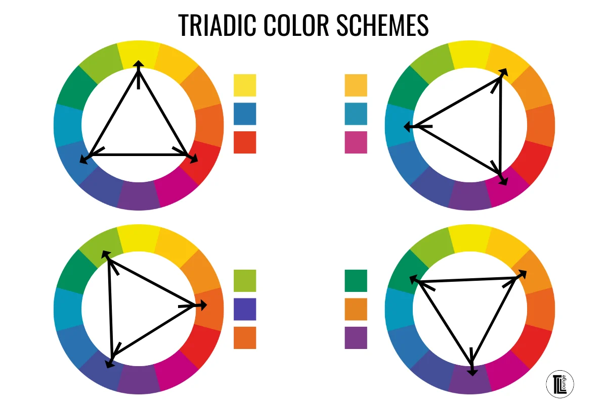
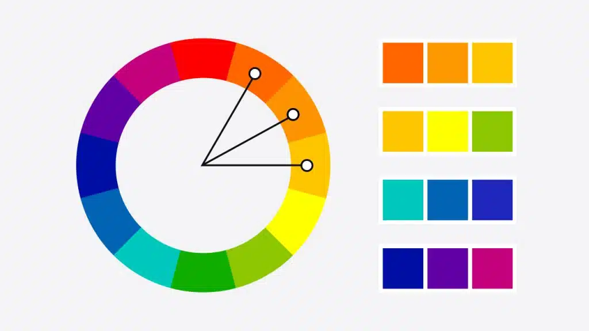
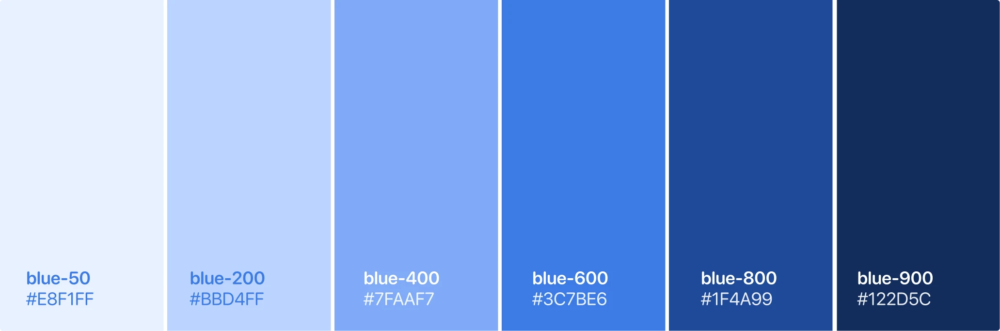
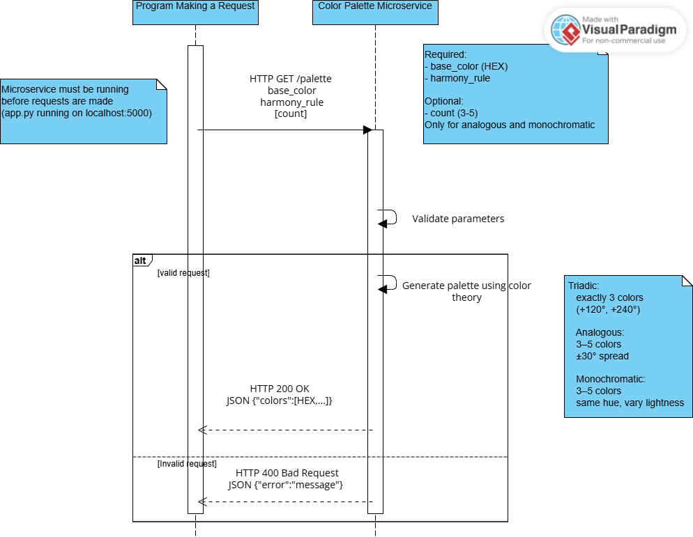

# Color Palette Generator — Microservice

## 1. What This Microservice Does

Given a base [HEX color](https://developer.mozilla.org/en-US/docs/Web/CSS/hex-color) and a [color harmony](https://www.adobe.com/creativecloud/design/hub/guides/understanding-color-harmony.html) rule, this microservice returns a set of harmonious HEX color codes computed using color theory.

**Supported harmony rules:**
### Triadic
Three colors evenly spaced **120° apart** on the [color wheel](https://www.sessions.edu/color-calculator/) — creates high-contrast, vibrant combinations. Always returns exactly 3 colors.


### Analogous
Colors within a **±30° arc** of the base hue — naturally cohesive, low-contrast palettes. Returns 3–5 colors.


### Monochromatic
Same hue, varying **lightness** — a unified, subtle palette. Returns 3–5 colors.


## 2. How to REQUEST Data from the Microservice
**The microservice must be running before any request is made.**
```bash
# Install the required dependency
pip install flask

# Start the microservice (runs on http://localhost:5000 by default)
python app.py
```
Send an [HTTP GET](https://developer.mozilla.org/en-US/docs/Web/HTTP/Methods/GET) request to:

```
http://localhost:5000/palette
```

### Query Parameters
- base_color (string, required): base color in HEX format
- harmony_rule (string, required): one of triadic, analogous, monochromatic
- count (integer, optional): number of colors to return, between 3 and 5, defaults to 3; only applies to analogous and monochromatic
### Example Requests

```python
import requests

# --- Triadic: always returns exactly 3 colors ---
response = requests.get(
    "http://localhost:5000/palette",
    params={
        "base_color": "#FF5733",    # starting color in HEX
        "harmony_rule": "triadic"   # no count needed — triadic is always 3
    }
)

# --- Analogous: request 4 colors ---
response = requests.get(
    "http://localhost:5000/palette",
    params={
        "base_color": "#FF5733",
        "harmony_rule": "analogous",
        "count": 4                  # optional; defaults to 3 if omitted
    }
)

# --- Monochromatic: use default count of 3 ---
response = requests.get(
    "http://localhost:5000/palette",
    params={
        "base_color": "#6A0DAD",
        "harmony_rule": "monochromatic"
        # count omitted → defaults to 3
    }
)
```
## 3. How to RECEIVE Data from the Microservice

The microservice always responds with [JSON](https://www.json.org/json-en.html).

### Success Response — HTTP 200

```json
{
  "colors": ["#FF5733", "#33FF57", "#5733FF"]
}
```

### Error Response — HTTP 400
```json
{
  "error": "base_color should be a valid HEX value(e.g. #FF5733)"
}
```
**Common error causes:**

- Invalid HEX format: `base_color=red` or `base_color=FF5733` (missing `#`) 
- Unsupported harmony rule: `harmony_rule=complementary` 
- `count` out of range: `count=6` or `count=1`

### Full Example: Sending a Request and Handling the Response
```python
import requests

# Request an analogous palette with 4 colors.
# The base color used in this example is #FF5733 (shown below).
response = requests.get(
    "http://localhost:5000/palette",
    params={
        "base_color": "#FF5733",
        "harmony_rule": "analogous",
        "count": 4
    }
)

if response.status_code == 200:
    data = response.json()       # parse the JSON response body
    colors = data["colors"]      # extract the list of HEX color strings
    print(colors)
    # → ['#FF3342', '#FF5733', '#FF8A33', '#FFBD33']
else:
    error = response.json()["error"]   # read the error message
    print(f"Error: {error}")
    # → Error: base_color should be a valid HEX value(e.g. #FF5733)
```
Base color in this example:


Output palette in this example:


## 4. UML Sequence Diagram

The diagram below shows the full request-response lifecycle: the client constructs a GET request with query parameters, the microservice validates the input and computes the palette, then returns either a JSON color array or an error message.

